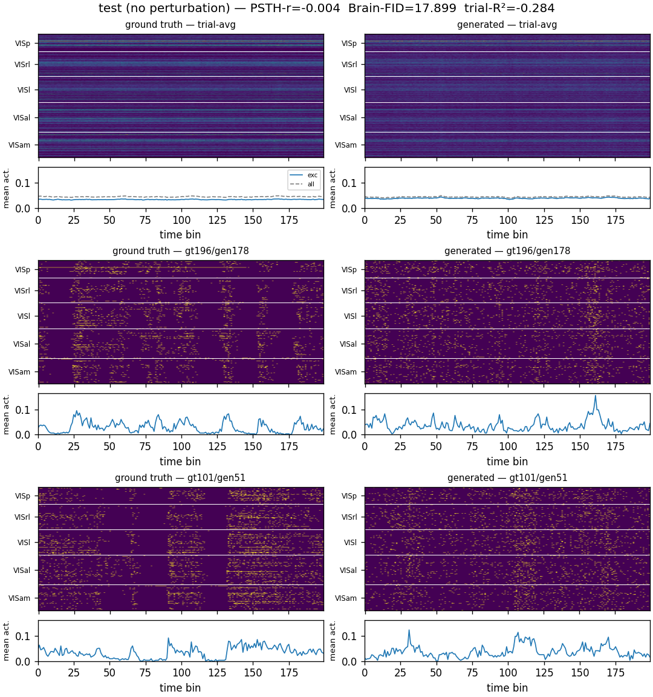
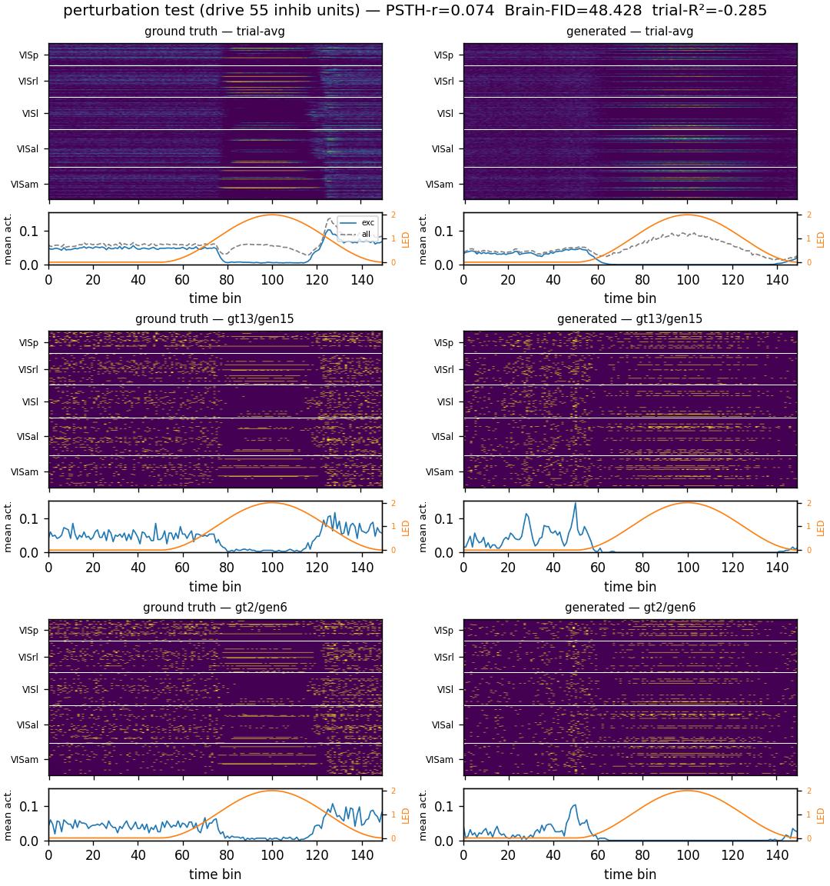

# Perturbation testing tutorial

## Context

Minimal Python tutorial for perturbation testing using RNN and spiking RNN.
to predict the effect of optogenetic stimulation of PV inhibitory neurons. 
It is a minimal reproduction of the results from Sourmpis et al., eLife 2026
(https://elifesciences.org/articles/106827).

We use data from the Allen institute Neuropixels dataset (see Siegle et al. 2021: https://www.nature.com/articles/s41586-020-03171-x) 
With use session 829720705 (Pvalb-Cre × Ai32, functional_connectivity*) which included targeted optogenetic of PV neurons with simultaneous Neuropixels recordings.

## Installation

Install [uv](https://docs.astral.sh/uv/), then sync the environment (this pins
the CUDA-12.6 PyTorch wheel — see `CLAUDE.md`):

```bash
uv sync
```

## Training a spontaneous-activity generator

```bash
uv run python train_rnn.py
```

We recommend trying the sign-constrained leaky integrate-and-fire model:

```bash
uv run python train_rnn.py 
uv run python train_rnn.py --model lif
uv run python train_rnn.py --sign-constrained
uv run python train_rnn.py --sign-constrained --model lif
```

Example test-set rasters after training (data vs. model, excitatory units only):

Without optogenetic perturbation:



With PV-opto perturbation (the model's inhibitory units are driven by the same
`i(t)` as the recordings):




